# 📊 Machine Failure Analysis
**Dataset:** AI4I 2020 Predictive Maintenance Dataset  
**Tools Used:** Microsoft Excel (Power Query, PivotTables, Charts), Basic Engineering Metrics

---

## 📌 Project Overview
This project analyzes **10,000 manufacturing records** to understand the conditions leading to machine failures.  
Failures are categorized into:

- **TWF** — Tool Wear Failure  
- **HDF** — Heat Dissipation Failure  
- **PWF** — Power Failure  
- **OSF** — Overstrain Failure  
- **RNF** — Random Failure

The goal is to identify which product types (L, M, H) and operating conditions contribute most to these failures.

---

## 🎯 Key Findings

### 🔥 Heat Dissipation Failure (HDF)
- Temperature difference (≈10 K) is similar across all types.
- **Type L** shows the highest HDF rate (**1.27%**).
- Suggests thermal load accumulates more during L-type cycles.

### ⚙️ Overstrain Failure (OSF)
- ToolWear × Torque is used as a mechanical load indicator.
- **Type L** has the highest mechanical load and the highest OSF rate (**1.45%**).

### ⚡ Power Failure (PWF)
- Power (Torque × RPM) is nearly identical across types.
- **Type M** exhibits the highest PWF rate (**1.03%**).

### 🛠️ Tool Wear Failure (TWF)
- All types have similar tool wear (~107–108 min).
- **Type H** shows the highest TWF rate (**0.70%**), consistent with faster wear (Type H adds +5 min per cycle).

### 🎲 Random Failure (RNF)
- Very low overall (<0.5%).
- Slightly higher in **Type H**.

---

## 📈 Dashboard Design (Excel)

### 🔹 **KPIs**

#### 1️⃣ Clustered Bar Chart — Count of Products by Product Type

  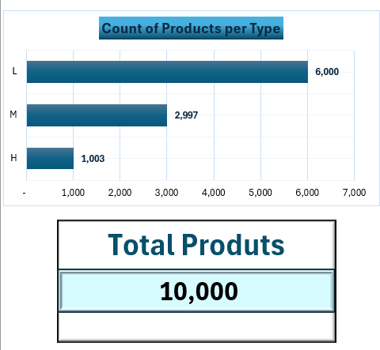
   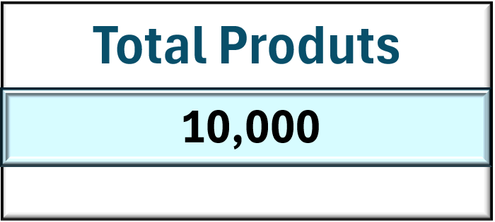

#### 2️⃣ Combo Chart (Clustered Column + Stacked Line) — Machine Failure Analysis by Product Type

  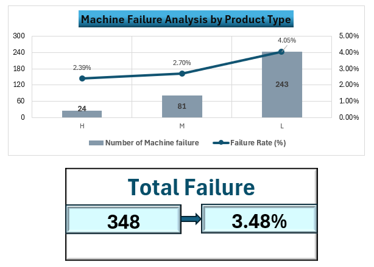
   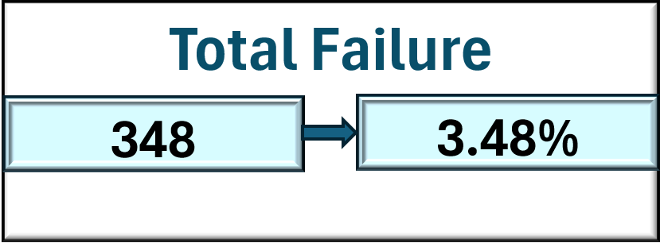

  

### 3️⃣ Pie Chart — Machine Failure Types Breakdown

  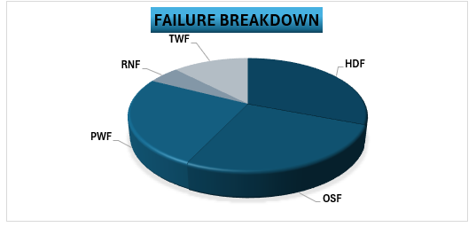

  

| 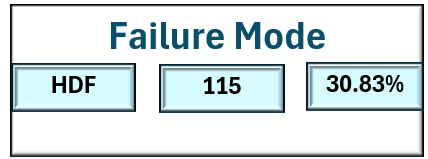 | 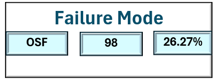 |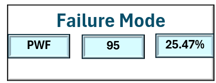 |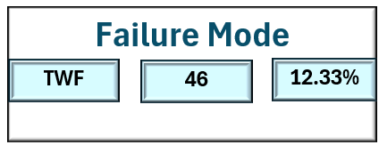 |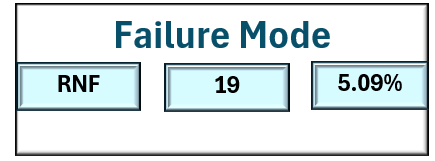 |
|--------------|--------------------|--------------------|--------------------|--------------------|

### 🔻 **Cause–Effect Analysis**
 
#### 🔥 HDF — Heat Dissipation Failure

  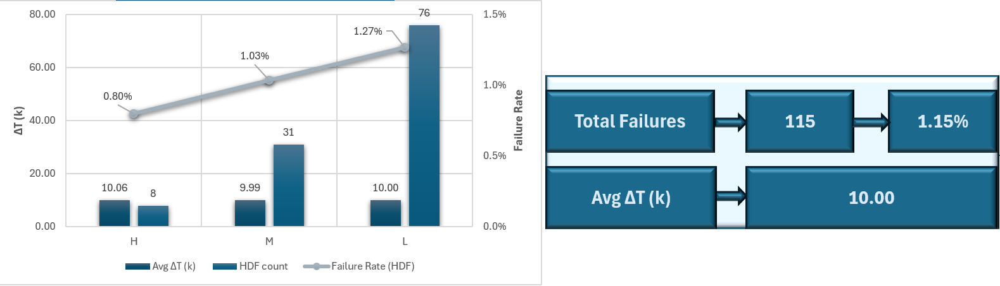

#### ⚙️ OSF — Overstrain Failure

  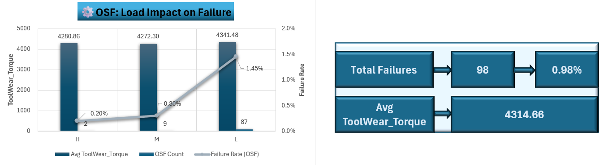

#### ⚡ PWF — Power Failure

  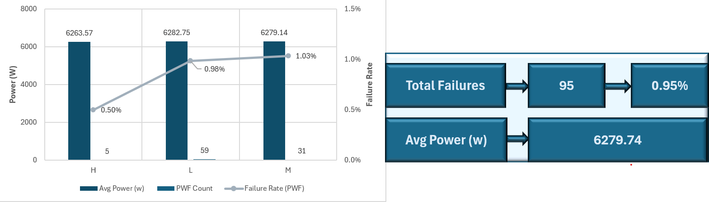

#### 🛠️ TWF — Tool Wear Failure

  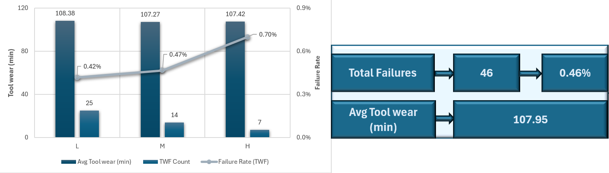

#### 🎲 RNF — Random Failure

  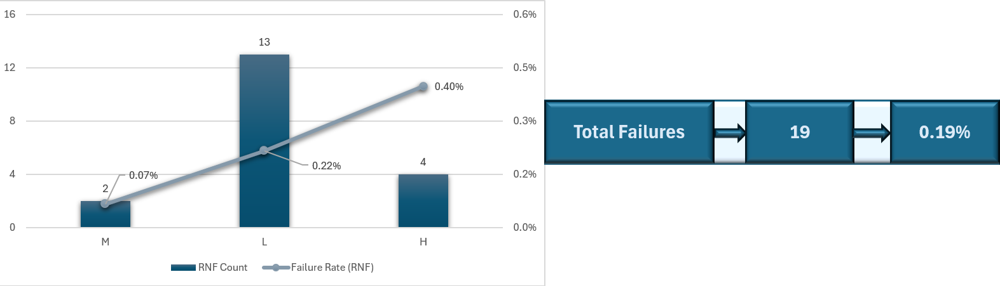

